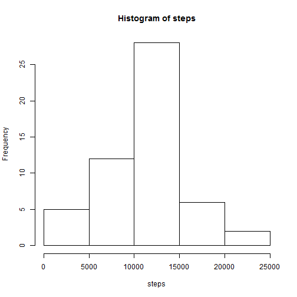
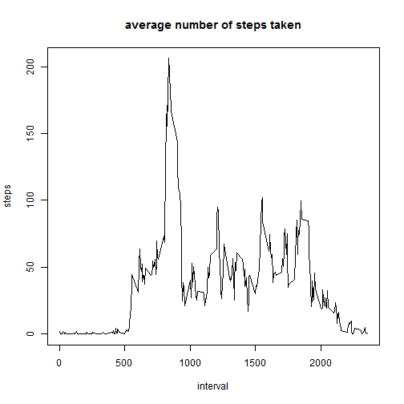
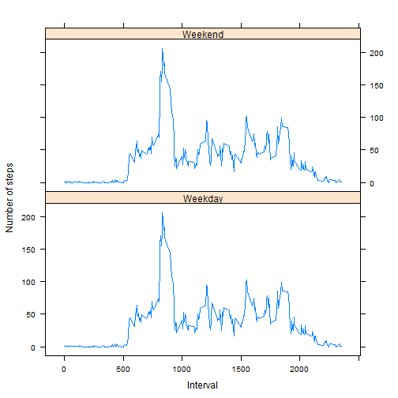

RepData_PeerAssessment1
===============================================
## Loading and preprocessing the data


```r
#1. Load the data
unzip("activity.zip")
data=read.csv("activity.csv")
#2. Process/ transform the data
data$date= as.Date(data$date)
str(data)
```

```
## 'data.frame':	17568 obs. of  3 variables:
##  $ steps   : int  NA NA NA NA NA NA NA NA NA NA ...
##  $ date    : Date, format: "2012-10-01" "2012-10-01" ...
##  $ interval: int  0 5 10 15 20 25 30 35 40 45 ...
```

## What is mean total number of steps taken per day?

```r
#Group data with sum steps by date
data2=aggregate(steps ~ date, data=data, FUN = sum)

#1. Histogram of the total number of steps taken by each day
with(data2, hist(steps))
```

 

```r
#2. Calculate the mean and median total number steps taken by each day
mean2=mean(data2$steps,na.rm=T)
median2=median(data2$steps,na.rm=T)
```
The __mean__ total number steps taken by each day is 1.0766 &times; 10<sup>4</sup>.

The __median__ total number steps taken by each day is 10765.

## What is the average daily activity pattern?

```r
#1. Time series plot 
data3 = aggregate(steps ~ interval, data=data, FUN = mean)
with(data3, plot(interval,steps,type="l", main="average number of steps taken"))
```

 

```r
#2. Interval with the maximum steps
maxinterval = data3[which.max(data3$steps),]$interval
```
835 interval, on average across all the days in the dataset, contains the maximum number of steps.

## Imputing missing values

```r
#1. Calculate total number of missing values in the dataset
data4=na.omit(data)
narows = dim(data)[1]-dim(data4)[1]
```
The total number of rows with NA is 2304.


```r
#2. Impute the missing value by the mean of same date
library(plyr)
impute.mean = function(x) replace(x, is.na(x), mean(x, na.rm = TRUE))

#3. Create a new dataset with missing value filed in
data5 = ddply(data, ~ date, transform, steps = impute.mean(steps))

#4. Make a histogram of the total number of steps
data6=aggregate(steps ~ date, data=data5, FUN = sum)

with(data6, hist(steps))
```

 

```r
mean6=mean(data6$steps,na.rm=T)
median6=median(data6$steps,na.rm=T)
```
The __mean__ total number steps taken by each day is 1.0766 &times; 10<sup>4</sup>.

The __median__ total number steps taken by each day is 1.0765 &times; 10<sup>4</sup>.

The difference of mean is 0.
The difference of median is 0.

## Are there differences in activity patterns between weekdays and weekends?

```r
Sys.setlocale("LC_TIME","US")
```

```
## [1] "English_United States.1252"
```

```r
#1. Create a new factor variable with "weekday" & "weekend"

data7=data5
data7$days=ifelse(weekdays(data7$date) %in% c("Saturday","Sunday"),"Weekend","Weekday")
data7$days=as.factor(data7$days)
data7= ddply(data7, ~interval,transform,steps=mean(steps,na.rm=T),days=days,date=date)

#2. Make a panel plot with weekdays
library(lattice)
with(data7, xyplot(steps~interval |days,type="l", layout=c(1,2),ylab="Number of steps",xlab="Interval"))
```

 

### Exporting file md & html

```r
#library("knitr")
#knit2html("PA1_template.Rmd")
```
